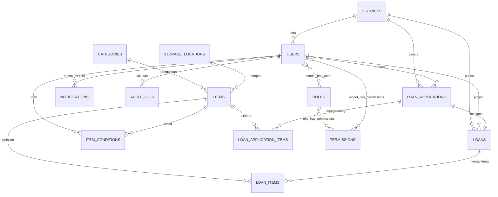
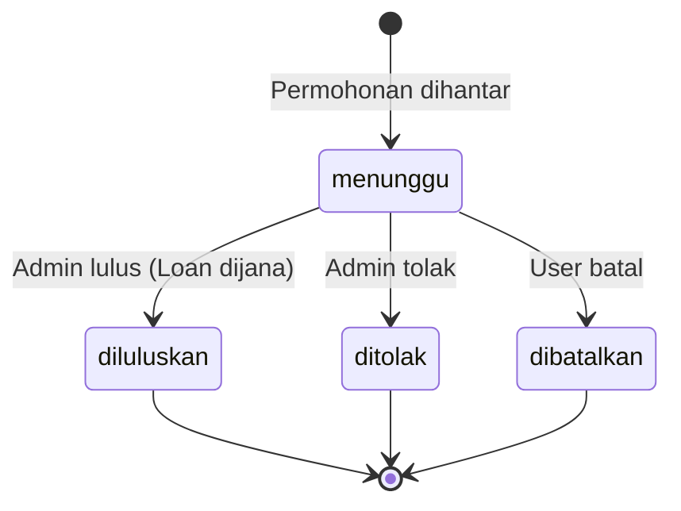
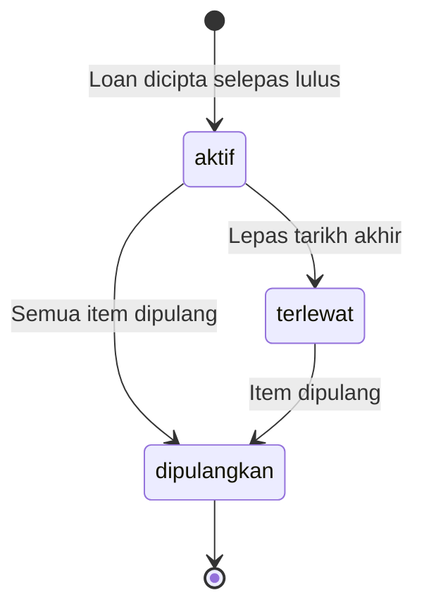
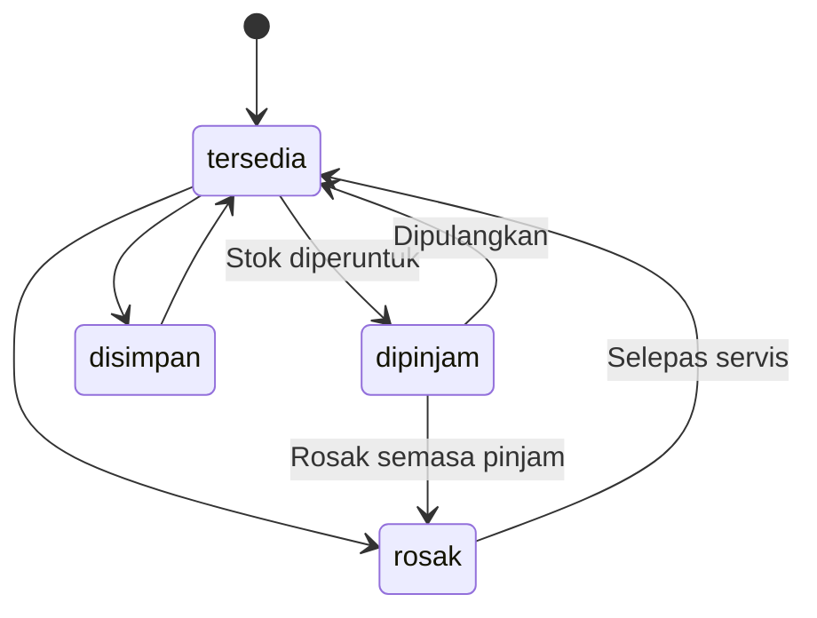
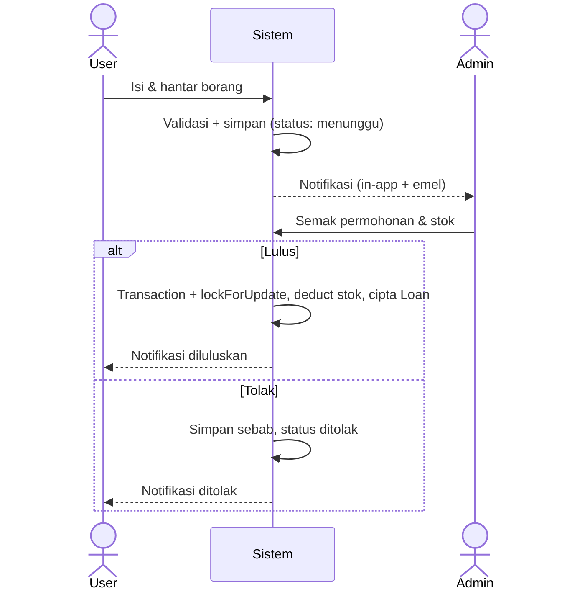
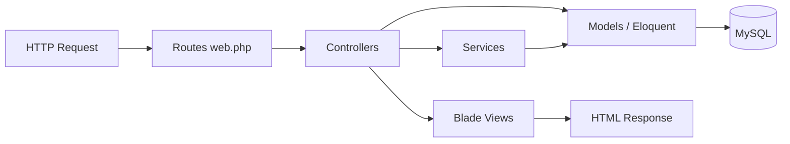
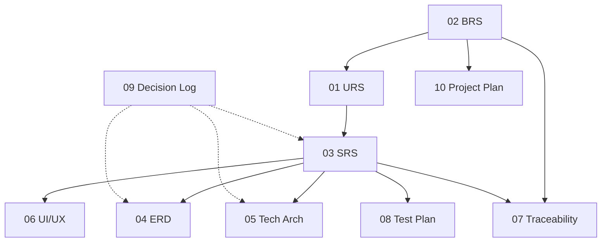

# Documentation Improvement Implementation Plan

> **For agentic workers:** REQUIRED SUB-SKILL: Use superpowers:subagent-driven-development (recommended) or superpowers:executing-plans to implement this plan task-by-task. Steps use checkbox (`- [ ]`) syntax for tracking.

**Goal:** Make the JPP Makmal `docs/` set internally consistent, gap-free, and build-ready as a development reference — by fixing cross-doc conflicts, filling spec gaps, adding 5 new documents, and upgrading complex diagrams to Mermaid.

**Architecture:** Edit the 6 existing docs in place (structure preserved), then create 5 new docs (`00`, `07`, `08`, `09`, `10`). Locked design decisions D1–D5 (notifications native, loan state handoff, plural routes, transactional stock locking, custom audit) drive the edits. A canonical FR scheme (FR-001…FR-025) is the backbone. Verification is grep-based consistency checks against the spec's Definition of Done.

**Tech Stack:** Markdown, Mermaid diagrams (rendered in VS Code/GitHub). Documents describe a Laravel 13 + MySQL + Spatie Permission + Blade/Tailwind system.

**Reference spec:** `docs/superpowers/specs/2026-06-22-docs-improvement-design.md`

---

## Pre-flight notes

- **Language:** All doc content is in Bahasa Melayu (match existing style; technical terms in English where the existing docs do).
- **Git:** This folder is **not** a git repository. Commit steps below are marked *(jika git)* — run `git init` first if you want version tracking, otherwise skip them.
- **Canonical FR scheme** (used by Tasks 3, 4, 8) — single source of truth:

| FR | Tajuk | Modul |
|----|-------|-------|
| FR-001 | Halaman Utama | Public |
| FR-002 | Halaman Login (papar borang) | Public |
| FR-003 | Autentikasi (POST, validate, redirect by role) | Auth |
| FR-004 | Dashboard User | User |
| FR-005 | Senarai Inventori (read-only) | User |
| FR-006 | Borang Permohonan Pinjaman | User |
| FR-007 | Detail Permohonan | User |
| FR-008 | Profil User | User |
| FR-009 | Logout | User |
| FR-010 | Dashboard Admin | Admin |
| FR-011 | Pengurusan Daerah | Admin |
| FR-012 | Pengurusan Kategori | Admin |
| FR-013 | Pengurusan Inventori | Admin |
| FR-014 | Pengurusan Lokasi Penyimpanan | Admin |
| FR-015 | Pengurusan Pengguna | Admin |
| FR-016 | Pengurusan Permohonan & Pinjaman | Admin |
| FR-017 | Notifikasi (in-app + emel) | Tambahan |
| FR-018 | QR Code | Tambahan |
| FR-019 | Audit Trail | Tambahan |
| FR-020 | Laporan & Analitik | Tambahan |
| FR-021 | Approval Workflow (satu peringkat) | Tambahan |
| FR-022 | Dashboard Visualisasi (carta) | Tambahan |
| FR-023 | Carian & Penapis Lanjutan | Tambahan |
| FR-024 | Lupa & Reset Kata Laluan *(baharu)* | Auth |
| FR-025 | Alert Luput & Low-Stock *(baharu)* | Tambahan |

---

## Task 1: Cipta Decision Log (09)

Establishes the WHY for D1–D6; referenced by all later edits.

**Files:**
- Create: `docs/09-Decision-Log.md`

- [ ] **Step 1: Tulis fail penuh**

Content:

````markdown
# Decision Log (ADR)
## Sistem Pengurusan Barangan Makmal — JPP Sabah

| Versi | Tarikh | Pengarang | Perubahan |
|-------|--------|-----------|-----------|
| 1.0 | 22 Jun 2026 | Pasukan Reka Bentuk | Rekod keputusan awal |

Dokumen ini merekod keputusan seni bina (Architecture Decision Records) supaya developer memahami *kenapa* sesuatu direka begitu.

---

## ADR-001: Sistem Notifikasi guna Laravel Native
**Status:** Diterima
**Konteks:** Tech stack menyebut "Laravel Notification + Mail", tetapi draf ERD asal mereka jadual `notifications` custom (title/message/is_read) yang tidak serasi dengan `DatabaseChannel` Laravel.
**Keputusan:** Guna sistem notifikasi native Laravel — channel `database` + `mail`, kelas Notification, dan skema jadual native (`id` UUID, `notifiable` morph, `data` JSON, `read_at`).
**Alternatif ditolak:** Jadual custom — lebih kawalan tetapi kehilangan `$user->notify()`, perlu tulis logik hantar/baca sendiri.
**Akibat:** Tajuk/mesej disimpan dalam lajur `data` (JSON). Notifikasi dipapar in-app (panel bell) + dihantar emel.

## ADR-002: State Machine Pinjaman — Handoff (Application → Loan)
**Status:** Diterima
**Konteks:** Status `dipinjam`/`dikembalikan` wujud pada kedua-dua `loan_applications` dan `loans`, menyebabkan kekaburan pemilikan keadaan.
**Keputusan:** `loan_applications.status` = `{menunggu, diluluskan, ditolak, dibatalkan}`. Apabila diluluskan, rekod `loans` dijana dan `loans.status` = `{aktif, dipulangkan, terlewat}` memegang kitaran pinjam.
**Alternatif ditolak:** Satu kitaran penuh pada `loan_applications` — menjadikan `loans.status` berlebihan.
**Akibat:** `loan_applications` enum dikurangkan; logik approve mencipta `loans`.

## ADR-003: Penamaan Route — Plural
**Status:** Diterima
**Konteks:** SRS guna `/user/loan-application/...` (singular); Tech Arch guna plural.
**Keputusan:** Gunakan plural di mana-mana (`/user/loan-applications/...`) selaras konvensyen `Route::resource` Laravel.

## ADR-004: Kawalan Over-Booking — Transaction + Pessimistic Lock
**Status:** Diterima
**Konteks:** OBJ-04 mensasarkan 0% over-booking tetapi tiada strategi concurrency didokumen.
**Keputusan:** Bungkus semua operasi ubah-stok dalam `DB::transaction` dengan `lockForUpdate()` pada baris `items`.
**Akibat:** `LoanService`/`InventoryService` mesti ikut corak ini (lihat Tech Arch §Concurrency).

## ADR-005: Audit Trail — Jadual Custom
**Status:** Diterima
**Konteks:** Pilihan antara jadual `audit_logs` custom atau pakej `spatie/laravel-activitylog`.
**Keputusan:** Kekalkan jadual `audit_logs` custom (sudah direka kemas, kawalan penuh).
**Alternatif dicatat:** `spatie/laravel-activitylog` — boleh dipertimbang jika keperluan audit berkembang.

## ADR-006: Approval Workflow — Satu Peringkat (buat masa ini)
**Status:** Diterima
**Konteks:** URS FR-021 menyebut "aliran kelulusan pelbagai peringkat", tetapi seluruh reka bentuk hanya ada satu pelulus (`approve-loan-applications`).
**Keputusan:** Laksana kelulusan **satu peringkat** untuk fasa ini. Kelulusan pelbagai peringkat ditangguh ke fasa akan datang.
**Akibat:** FR-021 didokumen sebagai satu peringkat; nota penangguhan ditambah.
````

- [ ] **Step 2: Verifikasi**

Run: `rg -n "ADR-00[1-6]" docs/09-Decision-Log.md`
Expected: 6 baris (ADR-001 hingga ADR-006).

- [ ] **Step 3: Commit** *(jika git)*

```bash
git add docs/09-Decision-Log.md
git commit -m "docs: add decision log (ADR-001..006)"
```

---

## Task 2: Kemas ERD (04)

**Files:**
- Modify: `docs/04-ERD-Entity-Relationship-Diagram.md`

- [ ] **Step 1: Ganti gambarajah konsep ASCII (§1.1) dengan Mermaid erDiagram**

Ganti blok ASCII dalam "### 1.1 Entity Overview" dengan:

````markdown


> Atribut penuh setiap entiti dalam §3 (Physical Data Model). Jadual Spatie (`roles`, `permissions`, pivot) dijana oleh pakej.
````

- [ ] **Step 2: Ganti jadual `notifications` (§3.12) dengan skema native Laravel**

Ganti seluruh jadual §3.12 dengan:

````markdown
### 3.12 Table: `notifications` (Laravel Native)

> Skema native Laravel (`php artisan make:notifications-table`). Lihat ADR-001.

| Column | Type | Constraints | Description |
|--------|------|-------------|-------------|
| id | CHAR(36) UUID | PK | ID notifikasi |
| type | VARCHAR | NOT NULL | Kelas Notification (App\Notifications\...) |
| notifiable_type | VARCHAR | NOT NULL | Model penerima (morph) |
| notifiable_id | BIGINT UNSIGNED | NOT NULL | ID penerima (morph) |
| data | JSON | NOT NULL | Payload (title, message, url, dll) |
| read_at | TIMESTAMP | NULL | Tarikh baca |
| created_at | TIMESTAMP | NULL | Tarikh cipta |
| updated_at | TIMESTAMP | NULL | Tarikh kemaskini |

**Indexes:**
- INDEX on (`notifiable_type`, `notifiable_id`)
````

- [ ] **Step 3: Kurangkan enum `loan_applications.status` (§3.8) — ADR-002**

Cari baris `status` dalam jadual §3.8 dan tukar ENUM kepada:
`ENUM('menunggu','diluluskan','ditolak','dibatalkan')` dengan DEFAULT `'menunggu'`.
Tambah nota selepas jadual:
> **Nota (ADR-002):** Status kitaran pinjam (`aktif`/`dipulangkan`/`terlewat`) dipegang oleh jadual `loans`, bukan di sini.

- [ ] **Step 4: Tambah lajur `minimum_quantity` pada `items` (§3.6)**

Tambah baris selepas `available_quantity`:

```markdown
| minimum_quantity | INTEGER | NOT NULL, DEFAULT 0 | Aras minimum (threshold amaran low-stock) |
```

Kemas contoh migration §5.2 dengan `$table->integer('minimum_quantity')->default(0);` selepas `available_quantity`.

- [ ] **Step 5: Tambah nota invariant `available_quantity` (selepas §3.6)**

```markdown
> **Invariant `available_quantity`:**
> `available_quantity = quantity − Σ(loan_items.quantity_loaned − loan_items.quantity_returned)`
> bagi `loans` berstatus `aktif`/`terlewat`. Dikira semula dalam `DB::transaction`
> (dengan `lockForUpdate`) semasa kelulusan & pemulangan. Lihat ADR-004.
```

- [ ] **Step 6: Tambah jadual `password_reset_tokens` (default Laravel) selepas §3.13**

````markdown
### 3.14 Table: `password_reset_tokens` (Laravel Default)

| Column | Type | Constraints | Description |
|--------|------|-------------|-------------|
| email | VARCHAR | PK | Emel pemohon reset |
| token | VARCHAR | NOT NULL | Token reset (hashed) |
| created_at | TIMESTAMP | NULL | Tarikh permohonan reset |

Digunakan oleh flow Lupa/Reset Kata Laluan (FR-024).
````

- [ ] **Step 7: Kemas senarai migration order (§5.1) & data dictionary (§6)**

Dalam §5.1, tukar komen `create_notifications_table` → `(Laravel native: make:notifications-table)` dan tambah nota `password_reset_tokens` sudah ada dalam migration default. Dalam §6, kekalkan baris `notifications` (data dictionary) tetapi tukar nota kepada "native Laravel".

- [ ] **Step 8: Kemas metadata & changelog**

Isi medan Pengarang dalam jadual versi, tambah baris:
`| 1.1 | 22 Jun 2026 | Pasukan Reka Bentuk | Notifikasi native, enum loan handoff, minimum_quantity, password_reset_tokens, Mermaid ERD |`

- [ ] **Step 9: Verifikasi**

Run: `rg -n "notifiable_type|minimum_quantity|password_reset_tokens|erDiagram" docs/04-ERD-Entity-Relationship-Diagram.md`
Expected: setiap istilah dijumpai sekurang-kurangnya sekali.
Run: `rg -n "dipinjam','dikembalikan" docs/04-ERD-Entity-Relationship-Diagram.md`
Expected: **tiada** padanan dalam enum `loan_applications` (status itu kini hanya pada `loans`).

- [ ] **Step 10: Commit** *(jika git)*

```bash
git add docs/04-ERD-Entity-Relationship-Diagram.md
git commit -m "docs(erd): native notifications, loan state handoff, minimum_quantity, Mermaid ERD"
```

---

## Task 3: Kemas URS (01)

**Files:**
- Modify: `docs/01-URS-User-Requirements-Specification.md`

- [ ] **Step 1: Tambah FR-024 & FR-025 dalam §4.4 (Modul Tambahan)**

Tambah baris pada jadual §4.4:

```markdown
| FR-024 | Lupa & Reset Kata Laluan | Sistem mesti membenarkan pengguna reset kata laluan melalui pautan emel |
| FR-025 | Alert Luput & Low-Stock | Sistem mesti memberi amaran kepada Admin bagi barang hampir luput dan stok rendah |
```

- [ ] **Step 2: Kemas FR-017 (Notifikasi)**

Tukar penerangan FR-017 kepada:
`Sistem mesti menghantar notifikasi in-app (panel bell) dan emel untuk permohonan baru, kelulusan/penolakan, peringatan pemulangan, dan amaran stok/luput`

- [ ] **Step 3: Sahkan keselarasan FR dengan skema kanonik**

Bandingkan §4.1–§4.4 dengan jadual kanonik (Pre-flight). URS sedia menggunakan FR-002=Login, FR-003=Autentikasi, FR-009=Logout — **sahkan tiada perubahan diperlukan** pada FR-001..FR-016 selain yang di atas.

- [ ] **Step 4: Metadata & changelog**

Isi Pengarang; tambah:
`| 1.1 | 22 Jun 2026 | Pasukan Reka Bentuk | Tambah FR-024 (reset password), FR-025 (alert), kemas FR-017 |`

- [ ] **Step 5: Verifikasi**

Run: `rg -n "FR-024|FR-025" docs/01-URS-User-Requirements-Specification.md`
Expected: kedua-dua dijumpai.

- [ ] **Step 6: Commit** *(jika git)*

```bash
git add docs/01-URS-User-Requirements-Specification.md
git commit -m "docs(urs): add FR-024 reset password, FR-025 alerts; update FR-017"
```

---

## Task 4: Kemas SRS (03)

The largest task. Split into discrete edits.

**Files:**
- Modify: `docs/03-SRS-Software-Requirements-Specification.md`

- [ ] **Step 1: Baiki FR-003 / Logout penomboran**

Dalam §4.1, jadual FR-003 kini bertajuk "Logout". Tukar:
- FR-002 → kekalkan untuk **papar borang login** (GET) sahaja.
- Tambah blok **FR-003: Autentikasi** (POST `/login`, `AuthController@authenticate`, validate, redirect by role).
- Pindahkan blok Logout menjadi **FR-009** di bawah §4.2 (Modul User), URL `/logout`, POST, `AuthController@logout`.

FR-003 baru:

```markdown
#### FR-003: Autentikasi
| Atribut | Penerangan |
|---------|------------|
| URL | `/login` |
| Method | POST |
| Controller | `AuthController@authenticate` |
| Validation | Email required+valid, Password required+min 8 |
| Post-Login | Redirect ke dashboard berdasarkan role |
```

FR-009 baru (akhir §4.2):

```markdown
#### FR-009: Logout
| Atribut | Penerangan |
|---------|------------|
| URL | `/logout` |
| Method | POST |
| Controller | `AuthController@logout` |
| Description | Destroy session, redirect ke halaman utama |
```

- [ ] **Step 2: Tukar semua URL route ke plural (ADR-003)**

Cari & ganti dalam §4.2:
- `/user/loan-application/create` → `/user/loan-applications/create`
- `/user/loan-application/{id}` → `/user/loan-applications/{id}`

- [ ] **Step 3: Tambah spec terperinci FR-017 (selepas §4.3, mula bahagian baru §4.4 "Modul Tambahan")**

````markdown
### 4.4 Modul Tambahan

#### FR-017: Notifikasi (Laravel Native)
| Atribut | Penerangan |
|---------|------------|
| URL | `/notifications` (senarai), `/notifications/{id}/read` (PUT) |
| Method | GET, PUT |
| Controller | `NotificationController@index`, `@markAsRead` |
| Middleware | `auth` |
| Channels | `database` (in-app bell) + `mail` |
| Triggers | Permohonan dihantar→Admin; Lulus/Tolak→Pemohon; Peringatan pulang→Peminjam; Low-stock & luput→Admin |
| Notification classes | ApplicationSubmitted, ApplicationApproved, ApplicationRejected, ReturnReminder, LowStockAlert, ExpiryAlert |
````

- [ ] **Step 4: Tambah FR-018 hingga FR-023**

````markdown
#### FR-018: QR Code
| Atribut | Penerangan |
|---------|------------|
| URL | `/admin/items/{id}/qr` |
| Method | GET |
| Controller | `ItemController@qr` |
| Middleware | `auth`, `permission:manage-items` |
| Library | simplesoftwareio/simple-qrcode |
| Output | Imej PNG/SVG; QR mengandungi URL detail item |

#### FR-019: Audit Trail
| Atribut | Penerangan |
|---------|------------|
| URL | `/admin/audit-logs` |
| Method | GET |
| Controller | `AuditLogController@index` |
| Middleware | `auth`, `permission:view-reports` |
| Storage | Jadual `audit_logs` (custom, ADR-005) |
| Logged actions | create/update/delete/approve/reject melalui `AuditService::log()` |
| Display | user, action, entity, old/new values, IP, masa |

#### FR-020: Laporan & Analitik
| Atribut | Penerangan |
|---------|------------|
| URL | `/admin/reports`, `/admin/reports/export/{type}` |
| Method | GET |
| Controller | `ReportController@index`, `@export` |
| Middleware | `auth`, `permission:view-reports` / `export-data` |
| Jenis laporan | (1) Inventori (stok/low-stock/luput), (2) Pinjaman (per daerah/tempoh/status), (3) Penggunaan barang (paling kerap), (4) Permohonan (ratio lulus/tolak, masa proses) |
| Export | PDF (DomPDF) & Excel (Laravel Excel) |
| Filters | Julat tarikh, daerah, kategori, status |

#### FR-021: Approval Workflow (Satu Peringkat)
| Atribut | Penerangan |
|---------|------------|
| States | menunggu → diluluskan/ditolak/dibatalkan (lihat §6.1) |
| Pelulus | Admin/Super Admin dengan `approve-loan-applications` |
| On approve | Cipta `Loan` dalam transaction+lock, deduct `available_quantity`, set `quantity_approved`, notify pemohon |
| On reject | Set `rejection_reason`, status `ditolak`, notify pemohon |
| Nota | Kelulusan pelbagai peringkat = luar skop fasa ini (ADR-006) |

#### FR-022: Dashboard Visualisasi
| Atribut | Penerangan |
|---------|------------|
| Library | Chart.js (plain JS) |
| Charts | Bar (tersedia vs dipinjam), Line (trend pinjaman bulanan), Pie (pinjaman per kategori/daerah) |
| Lokasi | Admin dashboard & halaman Laporan |

#### FR-023: Carian & Penapis Lanjutan
| Atribut | Penerangan |
|---------|------------|
| Skop | Inventori, permohonan, pinjaman, pengguna |
| Filters | Kata kunci, kategori, status, lokasi, daerah, julat tarikh |
| Implementasi | Eloquent query scopes + pagination |
````

- [ ] **Step 5: Tambah FR-024 & FR-025**

````markdown
#### FR-024: Lupa & Reset Kata Laluan
| Atribut | Penerangan |
|---------|------------|
| URL | `/forgot-password` (GET,POST), `/reset-password/{token}` (GET), `/reset-password` (POST) |
| Route names | password.request, password.email, password.reset, password.update |
| Controller | Laravel built-in (ForgotPassword/NewPassword) atau `AuthController` methods |
| Table | `password_reset_tokens` (default Laravel) |
| Flow | Masukkan emel → emel pautan reset → set kata laluan baru |
| Validation | Emel wujud, token sah (luput 60 min), password min 8 + confirmed |

#### FR-025: Alert Luput & Low-Stock
| Atribut | Penerangan |
|---------|------------|
| Trigger | Scheduled command harian memeriksa `items` |
| Command | `php artisan app:check-inventory-alerts` (`->daily()`) |
| Low-stock | `available_quantity <= minimum_quantity` → `LowStockAlert` ke Admin |
| Expiry | `expiry_date` dalam 30 hari → `ExpiryAlert` ke Admin |
| Display | Widget dashboard Admin "Stok Rendah" & "Barangan Hampir Luput" |
````

- [ ] **Step 6: Tambah §Concurrency (selepas §8 Performance, sebagai §8.1 atau bahagian baru)**

````markdown
## 8A. Concurrency & Transaction Handling (ADR-004)

Semua operasi yang mengubah stok (kelulusan permohonan, pemulangan barang) MESTI dibungkus
dalam `DB::transaction` dengan `lockForUpdate()` pada baris `items` untuk mengelak race
condition / over-booking (OBJ-04: 0% over-booking).

```php
DB::transaction(function () use ($itemId, $qty) {
    $item = Item::whereKey($itemId)->lockForUpdate()->first();
    if ($item->available_quantity < $qty) {
        throw new InsufficientStockException();
    }
    $item->decrement('available_quantity', $qty);
    // cipta loan_item ...
});
```
````

- [ ] **Step 7: Kemas State Transition Diagram (§6.1, §6.2) ke Mermaid (ADR-002)**

Ganti ASCII §6.1 dengan:

````markdown


**Kitaran pinjam (jadual `loans`):**


````

Ganti ASCII §6.2 (status item) dengan:

````markdown

````

- [ ] **Step 8: Kemas §5.1 Data Flow ke Mermaid sequenceDiagram (pilihan tetapi disyorkan)**

Ganti ASCII §5.1 dengan:

````markdown

````

- [ ] **Step 9: Kemas §7 Security — polisi & reset kata laluan**

Tambah baris pada jadual §7:

```markdown
| SEC-09 | Password Reset | Token reset luput 60 minit; guna jadual password_reset_tokens |
| SEC-10 | Password Policy | Minimum 8 aksara (Laravel Password rule) |
```

- [ ] **Step 10: Kemas metadata & changelog**

`| 1.1 | 22 Jun 2026 | Pasukan Reka Bentuk | Baiki FR-003/009, route plural, tambah FR-017..025, §Concurrency, Mermaid diagrams, polisi password |`

- [ ] **Step 11: Verifikasi**

Run: `rg -n "loan-application/create" docs/03-SRS-Software-Requirements-Specification.md`
Expected: **tiada** padanan (semua dah plural).
Run: `rg -n "FR-017|FR-018|FR-019|FR-020|FR-021|FR-022|FR-023|FR-024|FR-025" docs/03-SRS-Software-Requirements-Specification.md`
Expected: kesemua dijumpai (setiap satu kini ada spec terperinci).
Run: `rg -n "lockForUpdate|stateDiagram-v2" docs/03-SRS-Software-Requirements-Specification.md`
Expected: dijumpai.
Read §4.1 & §4.2: sahkan FR-003 = Autentikasi, FR-009 = Logout.

- [ ] **Step 12: Commit** *(jika git)*

```bash
git add docs/03-SRS-Software-Requirements-Specification.md
git commit -m "docs(srs): fix FR numbering, plural routes, detail FR-017..025, concurrency, Mermaid"
```

---

## Task 5: Kemas Technical Architecture (05)

**Files:**
- Modify: `docs/05-Technical-Architecture-Document.md`

- [ ] **Step 1: Route plural dalam contoh web.php (§4.1)**

URS sedia plural dalam Tech Arch; **sahkan** `/user/loan-applications/...` plural (sudah betul) dan tiada singular tertinggal.

- [ ] **Step 2: Tambah §Notifikasi Native (selepas §2 atau §7 Services)**

````markdown
## 7A. Notification Architecture (ADR-001)

Guna sistem notifikasi native Laravel. Setiap jenis notifikasi = kelas Notification yang
implement `ShouldQueue`, channel `database` + `mail`.

```php
class ApplicationApproved extends Notification implements ShouldQueue
{
    public function via($notifiable): array { return ['database', 'mail']; }
    public function toMail($notifiable): MailMessage { /* ... */ }
    public function toArray($notifiable): array {
        return ['title' => 'Permohonan Diluluskan', 'message' => '...', 'url' => '...'];
    }
}
```

Kelas: `ApplicationSubmitted`, `ApplicationApproved`, `ApplicationRejected`,
`ReturnReminder`, `LowStockAlert`, `ExpiryAlert`.
Hantar: `$user->notify(new ApplicationApproved($app));`
````

- [ ] **Step 3: Kemas blok Services (§7.1) — NotificationService selari native + tambah sendExpiryAlert**

Dalam senarai `NotificationService`, tambah method:
`public function sendExpiryAlert(Item $item): void`
dan tambah nota: "NotificationService bertindak sebagai fasad nipis yang memanggil `$user->notify(...)` dengan Notification classes (ADR-001)."

- [ ] **Step 4: Tambah §Concurrency (selepas §7A)**

````markdown
## 7B. Concurrency & Transactions (ADR-004)

`LoanService::approveApplication()` dan `returnItems()` membungkus perubahan stok dalam
`DB::transaction` + `lockForUpdate()` pada `items` untuk menjamin 0% over-booking.
(Lihat SRS §8A untuk corak kod.)
````

- [ ] **Step 5: Tambah route/controller password reset dalam §4.1**

Tambah dalam blok PUBLIC ROUTES:

```php
Route::get('/forgot-password', [AuthController::class, 'forgotForm'])->name('password.request');
Route::post('/forgot-password', [AuthController::class, 'sendResetLink'])->name('password.email');
Route::get('/reset-password/{token}', [AuthController::class, 'resetForm'])->name('password.reset');
Route::post('/reset-password', [AuthController::class, 'resetPassword'])->name('password.update');
```

- [ ] **Step 6: Nota Spatie belum dipasang**

Dalam §10.2 (atau §2.1), tambah nota:
> **Nota build:** `spatie/laravel-permission` belum ada dalam `composer.json` semasa. Jalankan `composer require spatie/laravel-permission` sebagai langkah pertama pembangunan.

- [ ] **Step 7: Tukar diagram MVC/senibina (§1.1, §1) ke Mermaid**

Ganti ASCII MVC §1.1 dengan:

````markdown

````

- [ ] **Step 8: Metadata & changelog**

`| 1.2 | 22 Jun 2026 | Pasukan Reka Bentuk | Notifikasi native, §Concurrency, route reset password, nota Spatie, Mermaid |`

- [ ] **Step 9: Verifikasi**

Run: `rg -n "ShouldQueue|password.update|lockForUpdate|flowchart" docs/05-Technical-Architecture-Document.md`
Expected: semua dijumpai.
Run: `rg -n "loan-application/" docs/05-Technical-Architecture-Document.md`
Expected: tiada singular.

- [ ] **Step 10: Commit** *(jika git)*

```bash
git add docs/05-Technical-Architecture-Document.md
git commit -m "docs(arch): native notifications, concurrency, password reset routes, Mermaid"
```

---

## Task 6: Kemas UI/UX (06)

**Files:**
- Modify: `docs/06-UI-UX-Design-Document.md`

- [ ] **Step 1: Tambah wireframe Laporan & Analitik (§3, selepas §3.7)**

````markdown
### 3.8 Laporan & Analitik (Admin)

```
┌──────────────────────────────────────────────────────────────┐
│  📊 Laporan & Analitik                    [Export PDF][Excel] │
├──────────────────────────────────────────────────────────────┤
│  Jenis: [Inventori ▼]  Daerah:[Semua ▼]  Tarikh:[__]-[__]   │
│                                                              │
│  ┌───────────────┐ ┌───────────────┐ ┌───────────────┐      │
│  │ Jumlah Barang │ │ Dipinjam      │ │ Low-Stock     │      │
│  │ 500           │ │ 87            │ │ 12            │      │
│  └───────────────┘ └───────────────┘ └───────────────┘      │
│                                                              │
│  [Line Chart: Trend Pinjaman Bulanan]                        │
│  [Bar Chart: Pinjaman per Daerah]                            │
│                                                              │
│  Jadual ringkasan + [< 1 2 3 >]                              │
└──────────────────────────────────────────────────────────────┘
```
````

- [ ] **Step 2: Tambah wireframe Lupa & Reset Kata Laluan (selepas §3.2)**

````markdown
### 3.2.1 Lupa Kata Laluan

```
┌─────────────────────────────┐
│   Lupa Kata Laluan          │
│   Masukkan emel anda:       │
│   ┌───────────────────────┐ │
│   │ emel@jpp.gov.my       │ │
│   └───────────────────────┘ │
│   [Hantar Pautan Reset]     │
│   ← Kembali ke Log Masuk    │
└─────────────────────────────┘
```

### 3.2.2 Reset Kata Laluan

```
┌─────────────────────────────┐
│   Set Kata Laluan Baru      │
│   Kata Laluan: [________]   │
│   Sahkan:      [________]   │
│   [Simpan Kata Laluan]      │
└─────────────────────────────┘
```
````

- [ ] **Step 3: Tambah wireframe Panel Notifikasi (bell) dalam §5 Component Library**

````markdown
### 5.8 Notification Panel (Bell)

```
            🔔(3)
┌────────────────────────────────┐
│ Notifikasi          [Tanda baca]│
├────────────────────────────────┤
│ ● Permohonan #LA-001 diluluskan │
│   2 minit lalu                  │
│ ● Stok rendah: pH Meter         │
│   1 jam lalu                    │
│ ○ Peringatan pulang #LN-002     │
│   semalam                       │
├────────────────────────────────┤
│        Lihat semua notifikasi   │
└────────────────────────────────┘
```
````

- [ ] **Step 4: Baiki jajaran ASCII tersasar**

Betulkan border tidak sejajar dalam landing page §3.1 (baris ~119-120, garis `│` tambahan) dan kotak warna status §2.1 (baris yang ada `│` berganda di hujung). Pastikan setiap kotak ada sempadan kiri/kanan seimbang.

- [ ] **Step 5: Metadata & changelog**

`| 1.1 | 22 Jun 2026 | Pasukan Reka Bentuk | Tambah wireframe Laporan, Reset Password, Panel Notifikasi; baiki jajaran ASCII |`

- [ ] **Step 6: Verifikasi**

Run: `rg -n "Laporan & Analitik|Lupa Kata Laluan|Notification Panel" docs/06-UI-UX-Design-Document.md`
Expected: ketiga-tiga dijumpai.

- [ ] **Step 7: Commit** *(jika git)*

```bash
git add docs/06-UI-UX-Design-Document.md
git commit -m "docs(uiux): add reports/reset-password/notification wireframes; fix ASCII"
```

---

## Task 7: Kemas BRS (02)

**Files:**
- Modify: `docs/02-BRS-Business-Requirements-Specification.md`

- [ ] **Step 1: Tukar kos `-` ke TBD eksplisit (§6.1)**

Dalam jadual §6.1, ganti setiap sel `-` dengan `TBD (belum ditentukan)`.

- [ ] **Step 2: Tambah pautan rujukan silang (akhir dokumen, sebelum §11 atau sebagai §12)**

````markdown
## 12. Dokumen Berkaitan
- Keperluan terperinci: `01-URS`, `03-SRS`
- Padanan objektif↔keperluan: `07-Traceability-Matrix.md`
- Pelan & jadual: `10-Project-Plan.md`
- Keputusan reka bentuk: `09-Decision-Log.md`
````

- [ ] **Step 3: Metadata & changelog**

`| 1.1 | 22 Jun 2026 | Pasukan Reka Bentuk | Kos TBD eksplisit, tambah pautan dokumen berkaitan |`

- [ ] **Step 4: Verifikasi**

Run: `rg -n "TBD|Dokumen Berkaitan" docs/02-BRS-Business-Requirements-Specification.md`
Expected: dijumpai.

- [ ] **Step 5: Commit** *(jika git)*

```bash
git add docs/02-BRS-Business-Requirements-Specification.md
git commit -m "docs(brs): explicit TBD costs, related-docs links"
```

---

## Task 8: Cipta Traceability Matrix (07)

**Files:**
- Create: `docs/07-Traceability-Matrix.md`

- [ ] **Step 1: Tulis fail penuh**

````markdown
# Traceability Matrix
## Sistem Pengurusan Barangan Makmal — JPP Sabah

| Versi | Tarikh | Pengarang | Perubahan |
|-------|--------|-----------|-----------|
| 1.0 | 22 Jun 2026 | Pasukan Reka Bentuk | Matriks pertama |

Memetakan Objektif Perniagaan (BRS) → Keperluan (URS/SRS FR) → Kes Ujian (Test Plan).

## 1. Objektif → Keperluan Fungsian

| OBJ | Penerangan | FR berkaitan |
|-----|-----------|--------------|
| OBJ-01 | Pusatkan inventori | FR-005, FR-013, FR-014, FR-012 |
| OBJ-02 | Percepat permohonan | FR-006, FR-016, FR-021 |
| OBJ-03 | Ketelusan status | FR-004, FR-007, FR-017 |
| OBJ-04 | Kurangkan over-booking | FR-016, FR-021 (concurrency SRS §8A) |
| OBJ-05 | Laporan tepat | FR-020, FR-022 |
| OBJ-06 | Kecekapan operasi | FR-006, FR-016, FR-023, FR-025 |

## 2. Keperluan Fungsian → Kes Ujian

| FR | Tajuk | Kes Ujian |
|----|-------|-----------|
| FR-001 | Halaman Utama | TC-001 |
| FR-002 | Halaman Login | TC-002 |
| FR-003 | Autentikasi | TC-003 |
| FR-004 | Dashboard User | TC-004 |
| FR-005 | Senarai Inventori | TC-005 |
| FR-006 | Borang Permohonan | TC-006 |
| FR-007 | Detail Permohonan | TC-007 |
| FR-008 | Profil User | TC-008 |
| FR-009 | Logout | TC-009 |
| FR-010 | Dashboard Admin | TC-010 |
| FR-011 | Pengurusan Daerah | TC-011 |
| FR-012 | Pengurusan Kategori | TC-012 |
| FR-013 | Pengurusan Inventori | TC-013 |
| FR-014 | Pengurusan Lokasi | TC-014 |
| FR-015 | Pengurusan Pengguna | TC-015 |
| FR-016 | Pengurusan Permohonan & Pinjaman | TC-016, TC-016b (over-booking) |
| FR-017 | Notifikasi | TC-017 |
| FR-018 | QR Code | TC-018 |
| FR-019 | Audit Trail | TC-019 |
| FR-020 | Laporan & Analitik | TC-020 |
| FR-021 | Approval Workflow | TC-021 |
| FR-022 | Dashboard Visualisasi | TC-022 |
| FR-023 | Carian Lanjutan | TC-023 |
| FR-024 | Lupa & Reset Kata Laluan | TC-024 |
| FR-025 | Alert Luput & Low-Stock | TC-025 |
````

- [ ] **Step 2: Verifikasi liputan**

Run: `rg -c "FR-0" docs/07-Traceability-Matrix.md`
Expected: ≥ 25 rujukan FR (setiap FR-001..025 hadir dalam §2).
Run: `rg -n "OBJ-0[1-6]" docs/07-Traceability-Matrix.md`
Expected: 6 objektif.

- [ ] **Step 3: Commit** *(jika git)*

```bash
git add docs/07-Traceability-Matrix.md
git commit -m "docs: add traceability matrix (OBJ->FR->TC)"
```

---

## Task 9: Cipta Test Plan (08)

**Files:**
- Create: `docs/08-Test-Plan.md`

- [ ] **Step 1: Tulis fail penuh**

````markdown
# Test Plan
## Sistem Pengurusan Barangan Makmal — JPP Sabah

| Versi | Tarikh | Pengarang | Perubahan |
|-------|--------|-----------|-----------|
| 1.0 | 22 Jun 2026 | Pasukan Reka Bentuk | Pelan ujian pertama |

## 1. Strategi Ujian
| Jenis | Alat | Skop |
|-------|------|------|
| Unit | PHPUnit | Services (LoanService, InventoryService), helpers |
| Feature | PHPUnit + Laravel HTTP tests | Route, controller, RBAC, validation |
| Integrasi | PHPUnit + DB (sqlite/mysql) | Transaction stok, notifikasi |
| UAT | Manual | Senario pengguna sebenar |

## 2. Kriteria Lulus
- Semua kes ujian PASS sebelum rilis.
- Liputan kod minimum 70% bagi Services.
- 0 ralat kritikal dalam UAT.

## 3. Katalog Kes Ujian (dipetakan ke FR)

| TC | FR | Senario | Jangkaan |
|----|----|---------|----------|
| TC-001 | FR-001 | Lawat `/` | Landing page dipapar, butang Login wujud |
| TC-002 | FR-002 | Lawat `/login` | Borang login dipapar |
| TC-003 | FR-003 | Login emel+password sah | Redirect ke dashboard ikut role |
| TC-003b | FR-003 | Login salah | Mesej ralat, kekal di login |
| TC-004 | FR-004 | User buka dashboard | Ringkasan pinjaman dipapar |
| TC-005 | FR-005 | User lihat inventori | Senarai read-only + carian |
| TC-006 | FR-006 | User hantar permohonan sah | Status `menunggu`, notifikasi ke Admin |
| TC-006b | FR-006 | Hantar tanpa barang | Validation error |
| TC-007 | FR-007 | Lihat detail permohonan sendiri | Detail dipapar |
| TC-008 | FR-008 | Kemas profil | Profil dikemaskini |
| TC-009 | FR-009 | Logout | Session musnah, redirect home |
| TC-010 | FR-010 | Admin dashboard | Statistik + permohonan menunggu |
| TC-011 | FR-011 | CRUD daerah | Cipta/ubah/padam berjaya |
| TC-012 | FR-012 | CRUD kategori | Berjaya |
| TC-013 | FR-013 | CRUD item | Berjaya, QR dijana |
| TC-014 | FR-014 | CRUD lokasi | Berjaya |
| TC-015 | FR-015 | CRUD pengguna (super_admin) | Berjaya; admin biasa dinafikan |
| TC-016 | FR-016 | Admin lulus permohonan | Loan dicipta, stok deduct, notifikasi |
| TC-016b | FR-016 | 2 kelulusan serentak melebihi stok | Hanya 1 berjaya (no over-booking) |
| TC-017 | FR-017 | Notifikasi dijana | Rekod database + emel dihantar |
| TC-018 | FR-018 | Jana QR item | Imej QR sah |
| TC-019 | FR-019 | Tindakan dilog | Rekod audit_logs dicipta |
| TC-020 | FR-020 | Jana & export laporan | PDF/Excel dimuat turun |
| TC-021 | FR-021 | Tolak permohonan | Sebab disimpan, status ditolak |
| TC-022 | FR-022 | Papar carta dashboard | Carta render dengan data betul |
| TC-023 | FR-023 | Carian + penapis | Hasil ditapis betul |
| TC-024 | FR-024 | Reset kata laluan | Emel reset, password ditukar |
| TC-025 | FR-025 | Command alert harian | Notifikasi low-stock & luput dihantar |

## 4. RBAC Test Matrix (ringkas)
| Role | Boleh | Tidak boleh |
|------|-------|-------------|
| user | view-dashboard, view-inventory, create-loan-application, view-own-applications | manage-*, approve |
| admin | semua manage-* kecuali users, approve, reports | manage-users |
| super_admin | semua | - |
````

- [ ] **Step 2: Verifikasi**

Run: `rg -c "TC-0" docs/08-Test-Plan.md`
Expected: ≥ 27 kes ujian.

- [ ] **Step 3: Commit** *(jika git)*

```bash
git add docs/08-Test-Plan.md
git commit -m "docs: add test plan with TC catalog mapped to FRs"
```

---

## Task 10: Cipta Project Plan (10)

**Files:**
- Create: `docs/10-Project-Plan.md`

- [ ] **Step 1: Tulis fail penuh**

````markdown
# Project Plan
## Sistem Pengurusan Barangan Makmal — JPP Sabah

| Versi | Tarikh | Pengarang | Perubahan |
|-------|--------|-----------|-----------|
| 1.0 | 22 Jun 2026 | Pasukan Reka Bentuk | Pelan projek pertama |

Tempoh sasaran: **3–4 bulan** (rujuk BRS §10.2).

## 1. Fasa & Milestone

| Fasa | Tempoh | Deliverable | Dependency |
|------|--------|-------------|------------|
| F0 — Setup | Minggu 1 | Repo, Laravel 13, Spatie dipasang, CI asas, .env | - |
| F1 — Skema & Auth | Minggu 2-3 | Migration semua jadual, seeder role/permission, login/logout, reset password (FR-001..003, 009, 024) | F0 |
| F2 — Master Data | Minggu 4-5 | CRUD daerah/kategori/lokasi/pengguna/item + QR (FR-011..015, 018) | F1 |
| F3 — Pinjaman | Minggu 6-8 | Borang permohonan, kelulusan, pinjaman, pemulangan, concurrency (FR-005..007, 016, 021) | F2 |
| F4 — Notifikasi & Alert | Minggu 9 | Notification classes, scheduled alerts (FR-017, 025) | F3 |
| F5 — Dashboard & Laporan | Minggu 10-11 | Dashboard user/admin, carta, laporan, export, carian (FR-004, 010, 020, 022, 023) | F3 |
| F6 — Audit & Pengukuhan | Minggu 12 | Audit trail, polisi keselamatan (FR-019, SEC-*) | F2 |
| F7 — UAT & Rilis | Minggu 13-16 | UAT, pembetulan, latihan, deployment | Semua |

## 2. Milestone Utama
- M1 (akhir F1): Pengguna boleh login & reset password.
- M2 (akhir F3): Kitaran pinjaman lengkap berfungsi tanpa over-booking.
- M3 (akhir F5): Dashboard & laporan siap.
- M4 (akhir F7): Sistem dilancarkan.

## 3. Risiko Jadual
Rujuk BRS §7 (Risk Assessment). Buffer 1-2 minggu disediakan dalam F7.
````

- [ ] **Step 2: Verifikasi**

Run: `rg -n "F0|F7|Milestone" docs/10-Project-Plan.md`
Expected: dijumpai.

- [ ] **Step 3: Commit** *(jika git)*

```bash
git add docs/10-Project-Plan.md
git commit -m "docs: add phased project plan"
```

---

## Task 11: Cipta README / Index (00)

Last, kerana ia merujuk semua dokumen lain.

**Files:**
- Create: `docs/00-README.md`

- [ ] **Step 1: Tulis fail penuh**

````markdown
# Dokumentasi — Sistem Pengurusan Barangan Makmal JPP Sabah

Set dokumentasi pra-pembangunan untuk Sistem Pengurusan Barangan Makmal (Laravel 13 + MySQL + Spatie Permission + Blade/Tailwind).

## Urutan Bacaan

| # | Dokumen | Status | Versi | Keterangan |
|---|---------|--------|-------|-----------|
| 01 | URS | Sedia | 1.1 | Keperluan pengguna, persona, FR |
| 02 | BRS | Sedia | 1.1 | Konteks perniagaan, objektif, ROI |
| 03 | SRS | Sedia | 1.1 | Spesifikasi fungsian terperinci |
| 04 | ERD | Sedia | 1.1 | Model data & data dictionary |
| 05 | Technical Architecture | Sedia | 1.2 | Seni bina, route, services, keselamatan |
| 06 | UI/UX Design | Sedia | 1.1 | Wireframe, design system |
| 07 | Traceability Matrix | Sedia | 1.0 | OBJ → FR → Kes Ujian |
| 08 | Test Plan | Sedia | 1.0 | Strategi & katalog kes ujian |
| 09 | Decision Log | Sedia | 1.0 | ADR (keputusan reka bentuk) |
| 10 | Project Plan | Sedia | 1.0 | Fasa, milestone, jadual |

## Cara Dokumen Berkait



## Keputusan Reka Bentuk Utama (lihat 09)
- **D1** Notifikasi = Laravel native (database + mail)
- **D2** State machine pinjaman = handoff (application → loan)
- **D3** Penamaan route = plural
- **D4** Over-booking dikawal = transaction + lockForUpdate
- **D5** Audit = jadual custom
- **D6** Approval = satu peringkat (buat masa ini)

## Glosari
| Istilah | Makna |
|---------|-------|
| JPP | Jabatan Perkhidmatan Pembetungan Sabah |
| HQ | Ibu Pejabat |
| Daerah | Pejabat Daerah JPP |
| RBAC | Role-Based Access Control (Spatie) |
| FR | Functional Requirement |
| ADR | Architecture Decision Record |
| TC | Test Case |
````

- [ ] **Step 2: Verifikasi**

Run: `rg -n "Urutan Bacaan|flowchart TD|D1|D6" docs/00-README.md`
Expected: dijumpai.

- [ ] **Step 3: Commit** *(jika git)*

```bash
git add docs/00-README.md
git commit -m "docs: add index/README with doc map and glossary"
```

---

## Task 12: Pas Semakan Konsistensi Akhir (Definition of Done)

**Files:** (read-only verification across all docs)

- [ ] **Step 1: Tiada route singular tertinggal**

Run: `rg -n "loan-application/" docs/`
Expected: **tiada** padanan di mana-mana fail.

- [ ] **Step 2: Tiada konflik FR-003**

Read URS §4.1 & SRS §4.1: sahkan FR-003 = "Autentikasi" di kedua-dua (bukan "Logout"); Logout = FR-009.

- [ ] **Step 3: Enum loan handoff konsisten**

Run: `rg -n "menunggu','diluluskan','ditolak','dibatalkan" docs/04-ERD-Entity-Relationship-Diagram.md`
Expected: dijumpai (enum dikemas). Sahkan `loans` ENUM = aktif/dipulangkan/terlewat.

- [ ] **Step 4: Notifikasi native konsisten**

Run: `rg -n "notifiable_type" docs/04-ERD-Entity-Relationship-Diagram.md && rg -n "ShouldQueue" docs/05-Technical-Architecture-Document.md`
Expected: kedua-dua dijumpai; tiada lagi rujukan jadual notifications custom (user_id/title/message) di ERD.

- [ ] **Step 5: Semua FR baharu hadir merentas dokumen**

Run: `rg -l "FR-024" docs/ && rg -l "FR-025" docs/`
Expected: muncul dalam URS, SRS, Traceability, Test Plan sekurang-kurangnya.

- [ ] **Step 6: 5 dokumen baharu wujud**

Run: `ls docs/00-README.md docs/07-Traceability-Matrix.md docs/08-Test-Plan.md docs/09-Decision-Log.md docs/10-Project-Plan.md`
Expected: kelima-lima wujud.

- [ ] **Step 7: Mermaid digunakan untuk diagram kompleks**

Run: `rg -c "```mermaid" docs/`
Expected: ERD, SRS (state×2 + sequence), Tech Arch (flowchart), README (flowchart) — beberapa blok mermaid.

- [ ] **Step 8: Semak terhadap Definition of Done spec**

Read `docs/superpowers/specs/2026-06-22-docs-improvement-design.md` §8 dan tanda setiap 9 kriteria sebagai dipenuhi. Betulkan sebarang jurang yang ditemui.

- [ ] **Step 9: Commit akhir** *(jika git)*

```bash
git add docs/
git commit -m "docs: final cross-document consistency pass"
```

---

## Self-Review Notes (penulis pelan)

- **Spec coverage:** Setiap item §4–§7 spec ada task — D1(T2,T5), D2(T2,T4), D3(T4,T5), D4(T4,T5), D5(T1), FR scheme(T3,T4), FR-024/025(T1,T3,T4,T6,T8,T9), new docs(T1,T8,T9,T10,T11), format(T2,T4,T5,T11). Definition of Done diverifikasi T12.
- **Placeholder scan:** Nilai "TBD" hanya dalam BRS kos (sengaja, §Task 7). Tiada TODO tergantung dalam pelan.
- **Type/name consistency:** Nama Notification classes (ApplicationSubmitted/Approved/Rejected, ReturnReminder, LowStockAlert, ExpiryAlert) konsisten antara T4, T5. Enum status konsisten antara T2, T4. FR IDs konsisten dengan jadual kanonik (Pre-flight).
